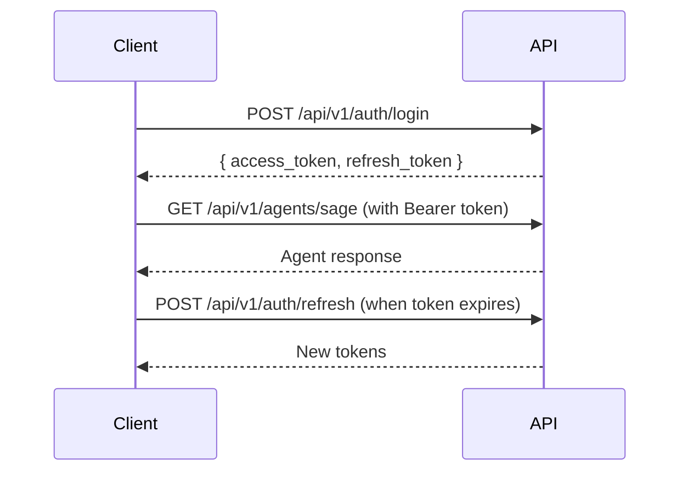

# 📘 GENESIS API Reference

> Complete API documentation for NGX GENESIS ecosystem integration

## 🌐 Base URL

```
Production: https://api.genesis.ngx.com
Staging: https://staging-api.genesis.ngx.com
Development: http://localhost:8000
```

## 🔐 Authentication

### Overview

GENESIS uses JWT (JSON Web Tokens) for authentication. All API requests must include an authorization header with a valid access token.

### Authentication Flow



### Endpoints

#### Login

```http
POST /api/v1/auth/login
Content-Type: application/json

{
  "email": "user@example.com",
  "password": "securepassword"
}
```

**Response:**
```json
{
  "access_token": "eyJhbGciOiJIUzI1NiIs...",
  "refresh_token": "eyJhbGciOiJIUzI1NiIs...",
  "token_type": "bearer",
  "expires_in": 3600
}
```

#### Register

```http
POST /api/v1/auth/register
Content-Type: application/json

{
  "email": "user@example.com",
  "password": "securepassword",
  "full_name": "John Doe"
}
```

#### Refresh Token

```http
POST /api/v1/auth/refresh
Authorization: Bearer {refresh_token}
```

#### Logout

```http
POST /api/v1/auth/logout
Authorization: Bearer {access_token}
```

## 🤖 Agent Endpoints

### Core Agents

All agent endpoints follow a similar pattern. Replace `{agent}` with the agent name.

#### Ask Agent

```http
POST /api/v1/agents/{agent}
Authorization: Bearer {access_token}
Content-Type: application/json

{
  "prompt": "Your question here",
  "conversation_id": "optional-conversation-id",
  "metadata": {
    "key": "value"
  }
}
```

**Available Agents:**
- `sage` - Nutrition expert
- `nexus` - Movement specialist
- `oracle` - Health insights
- `phoenix` - Recovery specialist
- `titan` - Strength coach
- `spark` - Motivation coach
- `echo` - Mental wellness
- `nova` - Innovation agent
- `zenith` - Peak performance
- `guardian` - Security & compliance
- `orchestrator` - Multi-agent coordinator

**Response:**
```json
{
  "agent": "sage",
  "response": "Based on your question...",
  "conversation_id": "uuid",
  "metadata": {
    "tokens_used": 150,
    "response_time": 1.2
  }
}
```

#### Stream Agent Response

```http
POST /api/v1/agents/{agent}/stream
Authorization: Bearer {access_token}
Content-Type: application/json

{
  "prompt": "Your question here",
  "conversation_id": "optional-conversation-id"
}
```

**Response:** Server-Sent Events (SSE) stream
```
data: {"chunk": "Based on ", "agent": "sage"}
data: {"chunk": "your question, ", "agent": "sage"}
data: {"chunk": "here's my advice...", "agent": "sage"}
data: {"done": true, "conversation_id": "uuid"}
```

#### Get Agent Info

```http
GET /api/v1/agents/{agent}/info
Authorization: Bearer {access_token}
```

**Response:**
```json
{
  "agent": "sage",
  "description": "Nutrition and dietary expert",
  "capabilities": [
    "meal_planning",
    "nutrition_analysis",
    "dietary_recommendations"
  ],
  "personality": "prime",
  "version": "1.0.0"
}
```

### Multi-Agent Conversations

#### Start Conversation

```http
POST /api/v1/conversations/start
Authorization: Bearer {access_token}
Content-Type: application/json

{
  "mode": "debate",
  "agents": ["sage", "nexus"],
  "topic": "Best workout nutrition strategies"
}
```

#### Continue Conversation

```http
POST /api/v1/conversations/{conversation_id}/continue
Authorization: Bearer {access_token}
Content-Type: application/json

{
  "prompt": "What about intermittent fasting?"
}
```

## 🌍 Ecosystem Gateway

### Overview

The ecosystem gateway provides unified access to all NGX tools through GENESIS.

### Blog Integration

#### Generate Content

```http
POST /api/v1/ecosystem/blog/generate-content
Authorization: Bearer {access_token}
Content-Type: application/json

{
  "topic": "Recovery techniques for athletes",
  "agent": "wave",
  "word_count": 1000,
  "style": "informative",
  "include_citations": true
}
```

**Response:**
```json
{
  "article": {
    "title": "5 Science-Backed Recovery Techniques",
    "content": "...",
    "metadata": {
      "word_count": 1024,
      "reading_time": 5,
      "seo_score": 92
    }
  },
  "citations": [
    {
      "text": "Study shows...",
      "source": "Journal of Sports Science, 2024"
    }
  ]
}
```

#### Optimize SEO

```http
POST /api/v1/ecosystem/blog/optimize-seo
Authorization: Bearer {access_token}
Content-Type: application/json

{
  "content": "Your article content...",
  "target_keywords": ["recovery", "athletes", "performance"]
}
```

### CRM Integration

#### Analyze Customer

```http
POST /api/v1/ecosystem/crm/analyze-customer
Authorization: Bearer {access_token}
Content-Type: application/json

{
  "customer_id": "cust_123",
  "metrics": {
    "usage_days": 45,
    "total_sessions": 120,
    "last_active": "2025-07-15",
    "subscription": "premium"
  }
}
```

**Response:**
```json
{
  "analysis": {
    "engagement_score": 8.5,
    "health_status": "active",
    "risk_factors": [],
    "opportunities": ["upsell_potential"]
  },
  "predictions": {
    "churn_risk": 0.15,
    "ltv_estimate": 2400,
    "next_best_action": "personalized_workout_plan"
  }
}
```

#### Calculate Churn Risk

```http
POST /api/v1/ecosystem/crm/churn-risk
Authorization: Bearer {access_token}
Content-Type: application/json

{
  "customer_id": "cust_123",
  "usage_data": {
    "days_since_signup": 90,
    "sessions_last_30_days": 12,
    "features_used": ["chat", "workouts"]
  },
  "prediction_window": 90
}
```

### Pulse Biometrics

#### Analyze Biometrics

```http
POST /api/v1/ecosystem/pulse/analyze-biometrics
Authorization: Bearer {access_token}
Content-Type: application/json

{
  "user_id": "user_123",
  "biometric_type": "hrv",
  "data_points": [
    {
      "timestamp": "2025-07-17T08:00:00Z",
      "value": 65,
      "unit": "ms",
      "device": "whoop"
    }
  ],
  "analysis_depth": "comprehensive"
}
```

**Response:**
```json
{
  "analysis": {
    "summary": "HRV trending upward",
    "metrics": {
      "average": 67.5,
      "trend": "improving",
      "variability": 12.3
    },
    "insights": [
      "Recovery is improving",
      "Stress levels decreasing"
    ],
    "recommendations": [
      "Maintain current training load",
      "Focus on sleep quality"
    ]
  }
}
```

#### Track Sleep

```http
POST /api/v1/ecosystem/pulse/track-sleep
Authorization: Bearer {access_token}
Content-Type: application/json

{
  "user_id": "user_123",
  "sleep_data": {
    "start_time": "2025-07-16T22:30:00Z",
    "end_time": "2025-07-17T06:45:00Z",
    "stages": {
      "deep": 95,
      "rem": 110,
      "light": 180,
      "awake": 10
    }
  }
}
```

### Core Workflows

#### Execute Workflow

```http
POST /api/v1/ecosystem/core/execute-workflow
Authorization: Bearer {access_token}
Content-Type: application/json

{
  "workflow_id": "monthly-report",
  "parameters": {
    "time_range": "last_30_days",
    "include_metrics": ["engagement", "revenue", "health_outcomes"],
    "format": "pdf"
  }
}
```

#### Generate Report

```http
POST /api/v1/ecosystem/core/generate-report
Authorization: Bearer {access_token}
Content-Type: application/json

{
  "report_type": "executive_summary",
  "parameters": {
    "period": "Q2-2025",
    "metrics": ["kpi", "growth", "retention"],
    "recipients": ["ceo@company.com"]
  }
}
```

### Conversations Insights

#### Get Session Insights

```http
POST /api/v1/ecosystem/conversations/insights
Authorization: Bearer {access_token}
Content-Type: application/json

{
  "session_id": "sess_123",
  "insight_type": "summary",
  "include_metrics": true
}
```

**Response:**
```json
{
  "insights": {
    "summary": "Engaging discussion about nutrition and training",
    "key_topics": ["protein", "recovery", "hydration"],
    "sentiment": "positive",
    "engagement_score": 8.7
  },
  "metrics": {
    "duration": 1245,
    "message_count": 42,
    "agent_switches": 3
  }
}
```

## 📊 User Data Endpoints

### Profile Management

#### Get Profile

```http
GET /api/v1/users/profile
Authorization: Bearer {access_token}
```

#### Update Profile

```http
PATCH /api/v1/users/profile
Authorization: Bearer {access_token}
Content-Type: application/json

{
  "display_name": "John Doe",
  "preferences": {
    "personality": "prime",
    "language": "en",
    "timezone": "America/New_York"
  }
}
```

### Progress Tracking

#### Get Progress

```http
GET /api/v1/progress/summary
Authorization: Bearer {access_token}
```

**Response:**
```json
{
  "overall_progress": 72,
  "streaks": {
    "current": 15,
    "longest": 23
  },
  "achievements": [
    {
      "id": "first_week",
      "name": "Week Warrior",
      "earned_at": "2025-07-10"
    }
  ],
  "stats": {
    "total_workouts": 45,
    "calories_burned": 12500,
    "active_minutes": 2340
  }
}
```

#### Log Activity

```http
POST /api/v1/progress/activities
Authorization: Bearer {access_token}
Content-Type: application/json

{
  "activity_type": "workout",
  "duration": 45,
  "details": {
    "type": "strength",
    "exercises": ["squat", "deadlift", "bench_press"]
  }
}
```

## 🔄 Real-time Features

### WebSocket Connection

```javascript
const ws = new WebSocket('wss://api.genesis.ngx.com/ws?token={access_token}')

ws.onmessage = (event) => {
  const data = JSON.parse(event.data)
  console.log('Received:', data)
}

// Subscribe to biometric updates
ws.send(JSON.stringify({
  type: 'subscribe',
  channel: 'biometrics',
  user_id: 'user_123'
}))
```

### Server-Sent Events (SSE)

```javascript
const eventSource = new EventSource(
  'https://api.genesis.ngx.com/api/v1/events?token={access_token}'
)

eventSource.addEventListener('agent-update', (event) => {
  const data = JSON.parse(event.data)
  console.log('Agent update:', data)
})
```

## ⚡ Rate Limiting

### Limits by Application

| Application | Per Minute | Per Hour | Per Day |
|-------------|------------|----------|---------|
| Default | 60 | 1,000 | 10,000 |
| Blog | 60 | 1,000 | 10,000 |
| CRM | 100 | 2,000 | 20,000 |
| Pulse | 120 | 3,000 | 30,000 |
| Core | 60 | 1,000 | 10,000 |
| Conversations | 200 | 5,000 | 50,000 |

### Rate Limit Headers

```http
X-RateLimit-Limit: 60
X-RateLimit-Remaining: 45
X-RateLimit-Reset: 1626789600
```

### Rate Limit Response

```http
HTTP/1.1 429 Too Many Requests
Content-Type: application/json
Retry-After: 60

{
  "error": {
    "code": "RATE_LIMIT_EXCEEDED",
    "message": "Rate limit exceeded. Try again in 60 seconds.",
    "details": {
      "limit": 60,
      "window": "minute",
      "retry_after": 60
    }
  }
}
```

## 🚨 Error Handling

### Error Response Format

```json
{
  "error": {
    "code": "ERROR_CODE",
    "message": "Human-readable error message",
    "details": {
      "field": "Additional context"
    },
    "request_id": "req_123abc"
  }
}
```

### Common Error Codes

| Code | Status | Description |
|------|--------|-------------|
| `UNAUTHORIZED` | 401 | Invalid or missing authentication |
| `FORBIDDEN` | 403 | Insufficient permissions |
| `NOT_FOUND` | 404 | Resource not found |
| `VALIDATION_ERROR` | 400 | Invalid request data |
| `RATE_LIMIT_EXCEEDED` | 429 | Too many requests |
| `INTERNAL_ERROR` | 500 | Server error |
| `SERVICE_UNAVAILABLE` | 503 | Service temporarily down |

### Error Examples

#### Validation Error

```http
HTTP/1.1 400 Bad Request
Content-Type: application/json

{
  "error": {
    "code": "VALIDATION_ERROR",
    "message": "Invalid request data",
    "details": {
      "prompt": "Field is required",
      "word_count": "Must be between 100 and 5000"
    }
  }
}
```

#### Authentication Error

```http
HTTP/1.1 401 Unauthorized
Content-Type: application/json

{
  "error": {
    "code": "TOKEN_EXPIRED",
    "message": "Access token has expired",
    "details": {
      "expired_at": "2025-07-17T10:00:00Z"
    }
  }
}
```

## 📋 Request/Response Examples

### Complete Workflow Example

#### 1. Login

```bash
curl -X POST https://api.genesis.ngx.com/api/v1/auth/login \
  -H "Content-Type: application/json" \
  -d '{
    "email": "user@example.com",
    "password": "securepassword"
  }'
```

#### 2. Ask Sage Agent

```bash
curl -X POST https://api.genesis.ngx.com/api/v1/agents/sage \
  -H "Authorization: Bearer {access_token}" \
  -H "Content-Type: application/json" \
  -d '{
    "prompt": "What should I eat before a morning workout?"
  }'
```

#### 3. Generate Blog Content

```bash
curl -X POST https://api.genesis.ngx.com/api/v1/ecosystem/blog/generate-content \
  -H "Authorization: Bearer {access_token}" \
  -H "Content-Type: application/json" \
  -d '{
    "topic": "Pre-workout nutrition",
    "agent": "sage",
    "word_count": 800
  }'
```

### Pagination

For endpoints that return lists, use pagination parameters:

```http
GET /api/v1/users/activities?page=2&limit=20
Authorization: Bearer {access_token}
```

**Response:**
```json
{
  "data": [...],
  "pagination": {
    "page": 2,
    "limit": 20,
    "total": 156,
    "pages": 8
  },
  "links": {
    "first": "/api/v1/users/activities?page=1&limit=20",
    "prev": "/api/v1/users/activities?page=1&limit=20",
    "next": "/api/v1/users/activities?page=3&limit=20",
    "last": "/api/v1/users/activities?page=8&limit=20"
  }
}
```

## 🛡️ Security

### Best Practices

1. **Always use HTTPS** in production
2. **Store tokens securely** (never in localStorage for sensitive apps)
3. **Implement token refresh** before expiration
4. **Validate webhook signatures** for incoming webhooks
5. **Use request IDs** for debugging and support

### Webhook Signature Verification

```python
import hmac
import hashlib

def verify_webhook_signature(payload, signature, secret):
    expected = hmac.new(
        secret.encode(),
        payload.encode(),
        hashlib.sha256
    ).hexdigest()
    return hmac.compare_digest(expected, signature)
```

## 🔄 Versioning

The API uses URL versioning. Current version: `v1`

```
https://api.genesis.ngx.com/api/v1/...
```

### Version Headers

Include version in headers for future compatibility:

```http
X-API-Version: 1.0.0
Accept: application/vnd.genesis.v1+json
```

## 📚 SDK Support

Official SDKs are available for:

- **TypeScript/JavaScript**: `@ngx/genesis-sdk`
- **Python**: `ngx-genesis-sdk` (coming soon)
- **Go**: `github.com/ngx/genesis-go` (coming soon)

## 🧪 Testing

### Test Environment

```
Base URL: https://sandbox-api.genesis.ngx.com
Test API Key: test_key_xxx
```

### Postman Collection

Download our Postman collection: [GENESIS API Collection](https://postman.com/genesis-api)

## 📞 Support

### Resources

- **Status Page**: https://status.genesis.ngx.com
- **Support**: support@ngx.com
- **Discord**: https://discord.gg/ngx-genesis

### Request IDs

All responses include a `X-Request-ID` header for support:

```http
X-Request-ID: req_1a2b3c4d5e
```

Include this ID when contacting support.

---

**Last Updated**: 2025-07-17  
**API Version**: 1.0.0  
**Maintainer**: NGX Platform Team