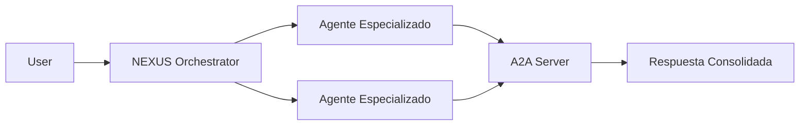

# Arquitectura ADK/A2A para Agentes NGX

## 🏗️ Visión General

Todos los agentes NGX siguen una arquitectura estandarizada basada en Google ADK (Agent Development Kit) y protocolo A2A (Agent-to-Agent). Esta arquitectura garantiza modularidad, escalabilidad y mantenibilidad.

## 📋 Reglas Fundamentales

### REGLA #1: Herencia Obligatoria

**TODOS los agentes DEBEN heredar de BaseNGXAgent Y ADKAgent:**

```python
from agents.base.base_ngx_agent import BaseNGXAgent
from agents.base.adk_agent import ADKAgent

class AgentName(BaseNGXAgent, ADKAgent):
    """Siempre hereda de AMBAS clases base."""
    pass
```

### REGLA #2: Estructura Modular

Cada agente debe seguir esta estructura:

```
agents/
└── agent_name/
    ├── __init__.py
    ├── agent.py         # < 400 líneas
    ├── config.py        # Configuración Pydantic
    ├── prompts.py       # Prompts centralizados
    ├── services/        # Servicios opcionales
    │   ├── __init__.py
    │   └── service.py
    └── skills/          # Skills modulares
        ├── __init__.py
        └── skill_name.py # Una skill por archivo
```

### REGLA #3: Límite de Líneas

- `agent.py`: Máximo 400 líneas
- Archivos de skills: Máximo 200 líneas
- Si un archivo excede el límite, debe dividirse en módulos

## 🔧 Implementación de Agentes

### 1. Configuración (config.py)

```python
from pydantic import BaseModel, Field
from typing import List

class AgentConfig(BaseModel):
    """Configuration for Agent."""
    
    name: str = Field(default="AGENT_NAME")
    agent_id: str = Field(default="agent_id")
    specialization: str = Field(default="Agent specialization")
    capabilities: List[str] = Field(default=["capability1", "capability2"])
    
    class Config:
        validate_assignment = True
```

### 2. Prompts (prompts.py)

```python
from typing import Dict, Any

class AgentPrompts:
    """Manages all prompts for Agent."""
    
    @staticmethod
    def get_base_instructions() -> str:
        """Get base instructions for agent."""
        return """Base agent instructions..."""
    
    @staticmethod
    def get_skill_prompt(data: Dict[str, Any]) -> str:
        """Get prompt for specific skill."""
        return f"""Process this data: {data}"""
```

### 3. Skills (skills/skill_name.py)

```python
from typing import Dict, Any
from core.logging_config import get_logger

logger = get_logger(__name__)

class SkillNameSkill:
    """Skill for specific functionality."""
    
    def __init__(self, agent):
        """Initialize skill with parent agent reference."""
        self.agent = agent
        self.name = "skill_name"
        self.description = "Skill description"
    
    async def execute(self, request: Dict[str, Any]) -> Dict[str, Any]:
        """Execute skill logic."""
        try:
            # Skill implementation
            result = await self._process(request)
            
            return {
                "success": True,
                "result": result,
                "skill_used": self.name
            }
        except Exception as e:
            logger.error(f"Error in {self.name}: {str(e)}")
            return {
                "success": False,
                "error": str(e),
                "skill_used": self.name
            }
```

### 4. Agente Principal (agent.py)

```python
import uuid
from typing import Dict, Any, Optional, List

# Core imports
from agents.base.base_ngx_agent import BaseNGXAgent
from agents.base.adk_agent import ADKAgent
from adk import Skill
from infrastructure.adapters.a2a_adapter import a2a_adapter
from core.logging_config import get_logger

# Agent-specific imports
from .config import AgentConfig
from .prompts import AgentPrompts
from .skills import SkillOne, SkillTwo

logger = get_logger(__name__)


class AgentName(BaseNGXAgent, ADKAgent):
    """Agent description."""
    
    def __init__(self, agent_id: Optional[str] = None):
        """Initialize agent."""
        # Load configuration
        self.config = AgentConfig()
        
        # Generate ID if not provided
        if not agent_id:
            agent_id = f"agent_{uuid.uuid4().hex[:8]}"
        
        # Initialize base classes
        BaseNGXAgent.__init__(
            self,
            agent_id=agent_id,
            name=self.config.name,
            specialization=self.config.specialization,
            system_prompt=AgentPrompts.get_base_instructions()
        )
        
        # Initialize ADKAgent
        ADKAgent.__init__(self, agent_id=agent_id)
        
        # Initialize components
        self.prompts = AgentPrompts()
        self._init_skills()
        self.adk_skills = self._create_adk_skills()
        
        logger.info(f"{self.name} agent initialized")
    
    def _init_skills(self):
        """Initialize agent skills."""
        self.skill_one = SkillOne(self)
        self.skill_two = SkillTwo(self)
    
    def _create_adk_skills(self) -> List[Skill]:
        """Create ADK skill definitions."""
        return [
            Skill(
                name="skill_one",
                description="Skill one description",
                handler=self._handle_skill_one
            ),
            Skill(
                name="skill_two",
                description="Skill two description",
                handler=self._handle_skill_two
            )
        ]
    
    async def process_request(self, request: Dict[str, Any]) -> Dict[str, Any]:
        """Process incoming request."""
        try:
            # Route to appropriate skill
            skill_type = self._analyze_request(request)
            return await self._route_to_skill(skill_type, request)
        except Exception as e:
            logger.error(f"Error processing request: {str(e)}")
            return {
                "success": False,
                "error": str(e),
                "agent": self.name
            }
    
    # ADK Handlers
    async def _handle_skill_one(self, request: Dict[str, Any]) -> Dict[str, Any]:
        """ADK handler for skill one."""
        return await self.skill_one.execute(request)
    
    async def _handle_skill_two(self, request: Dict[str, Any]) -> Dict[str, Any]:
        """ADK handler for skill two."""
        return await self.skill_two.execute(request)
    
    # A2A Integration
    async def handle_a2a_request(self, request: Dict[str, Any]) -> Dict[str, Any]:
        """Handle A2A protocol requests."""
        return await self.process_request(request)
```

## 📊 Agentes Implementados

| Agente | Tipo | Skills | Estado |
|--------|------|--------|---------|
| NEXUS | Core | 8 | ✅ ADK/A2A |
| BLAZE | Frontend | 7 | ✅ ADK/A2A |
| SAGE | Frontend | 8 | ✅ ADK/A2A |
| CODE | Frontend | 6 | ✅ ADK/A2A |
| WAVE | Frontend | 5 | ✅ ADK/A2A |
| LUNA | Frontend | 6 | ✅ ADK/A2A |
| STELLA | Frontend | 5 | ✅ ADK/A2A |
| SPARK | Frontend | 5 | ✅ ADK/A2A |
| NOVA | Frontend | 5 | ✅ ADK/A2A |
| GUARDIAN | Backend | 8 | ✅ ADK/A2A |
| NODE | Backend | 7 | ✅ ADK/A2A |

## 🔄 Flujo de Comunicación A2A



## ✅ Checklist de Implementación

Al crear o refactorizar un agente:

- [ ] Hereda de BaseNGXAgent Y ADKAgent
- [ ] Estructura modular con archivos < 400 líneas
- [ ] config.py con Pydantic
- [ ] prompts.py centralizado
- [ ] Skills en archivos separados
- [ ] Implementa handlers ADK
- [ ] Soporta protocolo A2A
- [ ] Tests con > 85% cobertura
- [ ] Documentación actualizada

## 🚀 Mejores Prácticas

1. **Modularidad**: Un archivo, una responsabilidad
2. **Reusabilidad**: Skills compartibles entre agentes
3. **Configurabilidad**: Todo parametrizable vía config
4. **Observabilidad**: Logging estructurado en todas las operaciones
5. **Testabilidad**: Diseño que facilita testing unitario

## 📚 Referencias

- [Google ADK Documentation](https://developers.google.com/adk)
- [A2A Protocol Specification](./A2A_PROTOCOL.md)
- [NGX Agent Guidelines](./AGENT_GUIDELINES.md)

---

Última actualización: 2025-07-18